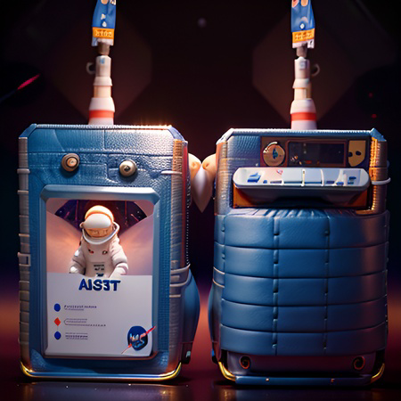

# Identity Badges

<figure><figcaption></figcaption></figure>

## What are Badges?

Badges manage privileged access to decentralized systems.  Badges are Non-fungible tokens (transferable or non-transferable) minted on the WAX blockchain.

* Blank Badges - Used to create a new authenticated (Auth), ranked, or trophy badge for an account.
* Auth Badges - Gives the owner privileged access to a system.
* Rank Badges - Marks a user's rank within an Auth Badge class.
* Trophy/Award Badges - Signifies accomplishment in a system.

## Why do I want Badges?

* Security
* Become a Web3 citizen

## How do I get Badges?

* Mint blank badges using BOXY Token
* Blend existing boxycoinnfts for blank badges
* Join a group
