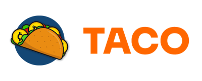

# Token

## Markets

> ## [Trade BOXY/WAX Now!](https://wax.alcor.exchange/trade/BOXY-boxycoinnfts\_WAX-eosio.token)
>
> 

> ## [Swap BOXY/WAX Now!](https://swap.tacocrypto.io/swap?output=WAX-eosio.token\&input=BOXY-boxycoinnfts)
>
> 

## Token Information

* [23,000,000](https://waxblock.io/tokens/BOXY-wax-boxycoinnfts) Max Supply - Distribution tokenomics available soon
* New utility coming September 2023!
* View the [contract](https://waxblock.io/account/boxycoinnfts#contract-abi)
* Earn BOXY by LP mining on Alcor and Taco
